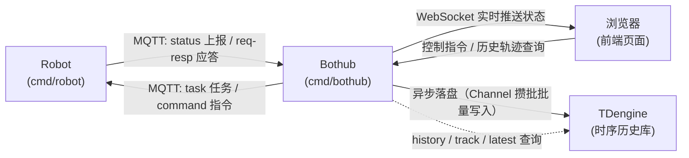

# mqbot

一个用于学习 Go 和 MQTT 实践的小项目。通过模拟"控制中心 ↔ 机器人"的通信场景，练习 MQTT 通信、消息协议设计、WebSocket 实时推送、并发控制、配置系统设计等内容。

## 已实现特性

| 特性 | 说明 |
|------|------|
| MQTT 通信 | 支持 MQTT v5，带连接重试、遗嘱消息（注入模式）、请求-响应模式 |
| 状态上报 | 增量上报（仅状态变化时发送，节省流量） |
| 任务下发 | 移动任务、实时停止、速度调节 |
| 自动充电 | 电量低于阈值自动充电，充到阈值停止 |
| WebSocket | 实时推送到浏览器，支持多客户端连接 |
| Web 控制台 | 单页应用，Canvas 可视化机器人位置 |
| 时序存储 | TDengine 落盘全量状态：超级表建模、Channel 攒批批量写入、背压丢弃、优雅关闭 flush |
| 历史/轨迹查询 | history / track / latest 接口，时间窗口降采样 |
| 统一响应 | `{code, msg, data}` 信封 + 集中定义的业务错误码（HTTP 状态码随错误码定义） |
| 运行指标 | `/metrics` 暴露消息量、连接数、落盘/丢弃计数 |
| 压测模拟器 | robot-simulator 批量模拟机器人上报 |
| 配置系统 | viper + pflag + .env，四层覆盖，validator 校验 |
| CORS 中间件 | 可配置的跨域资源共享 |

## 项目结构

```
mqbot/
├── cmd/
│   ├── bothub/            # 控制中心服务
│   │   └── main.go        # 入口：启动 MQTT + HTTP/WebSocket + TDengine 存储
│   ├── robot/             # 机器人客户端
│   │   └── main.go        # 入口：状态上报、任务执行、自动充电
│   └── robot-simulator/   # 机器人压测模拟器（批量模拟上报）
├── internal/
│   ├── config/            # 配置模块
│   │   ├── config.go      # 配置结构体定义
│   │   └── loader.go      # 配置加载（viper + pflag + .env + validator）
│   ├── database/          # TDengine 时序存储
│   │   ├── storage.go     # 连接管理、建库建表、生命周期
│   │   ├── writer.go      # 异步批量写入（Channel 攒批 + 背压丢弃）
│   │   └── query.go       # 历史/轨迹/最新状态查询
│   ├── hub/               # 设备注册表（内存实时视图）
│   ├── http/              # HTTP + WebSocket 服务封装
│   │   ├── server.go      # 服务启动与初始化（CORS 中间件）
│   │   ├── routes.go      # 路由注册、/metrics
│   │   ├── device_handler.go # 设备控制与历史查询 API
│   │   └── websocket.go   # WS 连接池、MQTT 消息桥接
│   ├── mqtt/              # MQTT 客户端封装（函数选项模式）
│   │   └── client.go      # 连接重试、订阅重试、遗嘱消息
│   ├── pkg/               # 通用基础包
│   │   ├── errcode/       # 业务错误码定义（含 HTTP 状态码）
│   │   └── response/      # 统一响应封装
│   └── robot/             # 机器人业务逻辑
│       └── move.go        # 移动算法（带取消支持）
├── protocol/              # 消息协议定义（与实现无关）
│   ├── message.go         # 统一信封结构、消息类型、工具函数
│   └── topic.go           # MQTT Topic 格式常量
├── configs/               # 配置文件
│   ├── bothub.yaml        # 控制中心配置
│   └── robot.yaml         # 机器人配置
├── static/                # Web 前端资源
│   └── index.html         # 控制台页面（Canvas 可视化）
├── go.mod
└── go.sum
```

## 架构



- **Robot**：通过 MQTT 上报状态（位置、电量、状态），支持任务取消和实时指令，响应中心的请求-响应查询
- **Bothub**：订阅所有机器人状态，通过 WebSocket 广播；接收 Web 指令转发到 MQTT；收到状态时异步写入 TDengine
- **TDengine**：全量状态历史落盘。职责边界：**内存 Registry 负责"现在"，TDengine 负责"过去"**——写库挂了只影响历史查询，不影响实时监控
- **浏览器**：Canvas 实时绘制机器人位置，发送移动/停止/调速指令，按时间段查询历史轨迹

## HTTP API

所有接口返回统一信封 `{code, msg, data}`：`code=0` 成功；业务失败（参数错误、设备不存在等）返回 HTTP 200 + 业务码，由前端按 `code` 处理；服务器故障类错误（存储未启用、查询失败）返回真实的 4xx/5xx。错误码集中定义在 `internal/pkg/errcode`。

| 方法 | 路径 | 说明 |
|------|------|------|
| GET | `/api/v1/robots/` | 设备列表 |
| GET | `/api/v1/robots/:id` | 设备详情 |
| POST | `/api/v1/robots/:id/move` | 下发移动任务（body: `{x, y}`） |
| POST | `/api/v1/robots/:id/stop` | 下发停止指令 |
| GET | `/api/v1/devices/:id/status` | 实时状态（MQTT 请求-响应，带超时） |
| GET | `/api/v1/devices/:id/history` | 历史状态点，`?from=&to=&limit=`（毫秒时间戳，缺省最近 1 小时） |
| GET | `/api/v1/devices/:id/track` | 轨迹降采样，`?from=&to=&interval=10s`（只允许数字+s/m/h） |
| GET | `/api/v1/devices/:id/latest` | 最新落盘状态 |
| GET | `/api/v1/metrics` | 运行指标 |

## 配置系统

采用四层覆盖机制，优先级从低到高：

```
默认值 < 配置文件(YAML) < 环境变量 < 命令行参数(pflag)
```

环境变量统一使用 `MQBOT_` 前缀，点号（`.`）替换为下划线（`_`），例如：
- `mqtt.host` → `MQBOT_MQTT_HOST`
- `http.port` → `MQBOT_HTTP_PORT`

同时支持 `.env` 文件自动加载。

### 配置结构

- **MQTT 配置**：连接参数、认证、会话、遗嘱（元信息）、重试策略
- **HTTP 配置**：监听地址、WebSocket、CORS、API 前缀
- **Robot 行为配置**：初始参数、上报阈值、电量策略
- **日志配置**：级别、格式、输出方式

### 设计要点

- **配置即纯数据**：配置结构体只含可序列化字段，运行时依赖（回调、遗嘱内容）通过函数选项注入
- **函数选项模式**：`mqtt.NewClient(cfg, WithHandler(h), WithWillTopic(t), WithWillPayload(p))`
- **Fail-fast 校验**：加载后立即用 validator 校验，配置错误启动即报错

## 运行方式

### 前置条件

需要先启动一个 MQTT Broker（推荐 [mosquitto](https://mosquitto.org/)），默认监听 `127.0.0.1:1883`。

启用时序存储（可选）需要 TDengine，Docker 一键启动（REST 驱动只需 6041 端口可达）：

```bash
docker run -d --name tdengine -p 6030-6049:6030-6049 -p 6041:6041 tdengine/tdengine
```

存储相关配置在 `configs/bothub.yaml` 的 `database` 段（`enabled: false` 时 hub 完全不碰数据库，行为与无存储版本一致）：

```yaml
database:
    enabled: true
    host: 127.0.0.1   # 改成远程 IP 即远程连接
    port: 6041        # taosAdapter REST 端口
    write:
        batch_size: 500        # 攒够 500 条刷一次
        flush_interval_ms: 1000 # 或最多 1 秒刷一次，先到先触发
        channel_cap: 10000     # 内存缓冲容量，满了丢弃并计数（不阻塞 MQTT 链路）
```

### 启动控制中心

```bash
go run ./cmd/bothub
# 指定配置文件
go run ./cmd/bothub --config configs/bothub.yaml
# 覆盖部分配置
go run ./cmd/bothub --mqtt-host localhost --mqtt-port 1883 --http-port 8080
```

控制中心启动后访问 `http://localhost:8080` 即可看到监控页面。

### 启动机器人

可启动多个机器人实例，每个会在页面上独立显示：

```bash
go run ./cmd/robot --id bot_0001
# 指定配置文件
go run ./cmd/robot --config configs/robot.yaml --id bot_0001
# 覆盖 MQTT 配置
go run ./cmd/robot --server localhost --port 1883 --id bot_0001
```

**命令行参数（bothub）：**

| 参数           | 默认值                | 说明                         |
| -------------- | --------------------- | ---------------------------- |
| `--config`     | `configs/bothub.yaml` | 配置文件路径                 |
| `--mqtt-host`  | 配置文件值            | MQTT Broker 地址             |
| `--mqtt-port`  | 配置文件值            | MQTT Broker 端口             |
| `--http-port`  | 配置文件值            | HTTP 服务端口                |

**命令行参数（robot）：**

| 参数         | 默认值               | 说明                         |
| ------------ | -------------------- | ---------------------------- |
| `--config`   | `configs/robot.yaml` | 配置文件路径                 |
| `--server`   | 配置文件值           | MQTT Broker 地址             |
| `--port`     | 配置文件值           | MQTT Broker 端口             |
| `--id`       | 配置文件值           | 客户端 ID / 机器人 ID        |

### 完整示例

```bash
# 终端 1：启动控制中心
go run ./cmd/bothub

# 终端 2：启动机器人 1
go run ./cmd/robot --id bot_001

# 终端 3：启动机器人 2
go run ./cmd/robot --id bot_002
```

访问 `http://localhost:8080`，点击画布即可控制机器人移动。

### 压测模拟器

批量模拟机器人上报，用于验证 hub 吞吐与存储链路：

```bash
go run ./cmd/robot-simulator --robots 100 --rate 2 --duration 60
```

| 参数 | 默认值 | 说明 |
|------|--------|------|
| `--robots` | 100 | 模拟机器人数量 |
| `--rate` | 2 | 每个机器人上报频率（Hz） |
| `--duration` | 60 | 压测时长（秒） |
| `--host` / `--port` | 127.0.0.1 / 1883 | MQTT Broker 地址 |
| `--max-conns` | 50 | 最大并发连接数（防止瞬间打满 Broker） |

压测时通过 `/api/v1/metrics` 观察 `msgs_received_total` 与落盘指标是否对得上。

## 通信协议

### MQTT 主题

| Topic                  | QoS | 方向           | 说明                     |
| ---------------------- | --- | -------------- | ------------------------ |
| `robot/{id}/status`    | 0   | 机器人 → 中心  | 状态上报（遗嘱使用QoS=1）|
| `robot/{id}/task`      | 2   | 中心 → 机器人  | 下发任务（异步）         |
| `robot/{id}/command`   | 2   | 中心 → 机器人  | 下发实时指令（同步）     |
| `robot/{id}/req`       | 1   | 中心 → 机器人  | 请求-响应：请求主题      |
| `robot/{id}/resp`      | 1   | 机器人 → 中心  | 请求-响应：响应主题      |

> 💡 请求-响应模式：中心向 `req` 发请求、在 `resp` 上等待对应 `msg_id` 的响应，带超时。用于 `/devices/:id/status` 这类"要设备当场回答"的查询，区别于被动收状态上报。

### 消息信封格式

所有消息共享统一信封结构，便于版本兼容和链路追踪：

```json
{
  "header": {
    "ver": "1.0",      // 协议版本
    "msg_id": "uuid",  // 消息唯一ID
    "ts": 1234567890   // 发送时间戳（秒）
  },
  "body": { ... }      // 业务数据
}
```

### 状态上报（StatusBody）

```json
{
  "id": "bot_0001",
  "x": 1.5,
  "y": 2.3,
  "battery": 80,
  "state": "MOVING",    // IDLE / MOVING / CHARGING / ERROR / OFFLINE
  "speed": 1.0,
  "task_id": "uuid"     // 当前执行的任务，空闲时省略
}
```

**上报策略**：并非定时上报，只有以下情况才发送：
- 电量变化超过阈值
- 状态机状态变更
- 位置变化超过阈值
- 速度变化超过阈值

阈值可在配置文件中调整。

### 任务下发（TaskBody）

```json
{
  "task_id": "uuid",
  "action": "move_to",
  "params": { "x": "5.0", "y": "3.0" },
  "priority": "NORMAL"   // HIGH / NORMAL / LOW
}
```

### 实时指令（CommandBody）

```json
{
  "action": "stop",      // stop / set_speed
  "params": { "speed": 2.0 }
}
```

> 💡 指令与任务的区别：任务有ID可追踪，指令无ID即时生效

## 主要依赖

| 库 | 用途 |
|----|------|
| [eclipse/paho.golang](https://github.com/eclipse/paho.golang) | MQTT v5 客户端 |
| [gin-gonic/gin](https://github.com/gin-gonic/gin) | Web 框架 |
| [gorilla/websocket](https://github.com/gorilla/websocket) | WebSocket 支持 |
| [spf13/viper](https://github.com/spf13/viper) | 配置管理 |
| [spf13/pflag](https://github.com/spf13/pflag) | 命令行参数解析 |
| [joho/godotenv](https://github.com/joho/godotenv) | .env 文件加载 |
| [go-playground/validator](https://github.com/go-playground/validator) | 配置校验 |
| [gin-contrib/cors](https://github.com/gin-contrib/cors) | CORS 中间件 |
| [google/uuid](https://github.com/google/uuid) | UUID 生成 |
| [taosdata/driver-go](https://github.com/taosdata/driver-go) | TDengine REST 驱动（taosRestful） |

## 学习要点

这个项目覆盖了以下 Go 和分布式系统知识点：

### MQTT 协议
- MQTT v5 连接流程与参数配置
- 遗嘱消息（Will Message）实现离线检测
- QoS 级别选择与适用场景
- 订阅/发布的重试机制设计
- 函数选项模式封装客户端

### 并发编程
- `time.Ticker` 定时任务
- `context.WithCancel` 任务取消
- `sync.Mutex` 共享资源保护
- Channel 用于 goroutine 通信
- WebSocket 连接池管理

### 配置系统
- viper 配置加载与四层覆盖
- pflag 命令行参数绑定
- .env 文件与环境变量
- validator 结构体校验
- 配置与运行时依赖分离（注入模式）

### 协议设计
- 统一信封结构的扩展性考虑
- 增量上报的流量优化策略
- 类型安全的参数读取工具
- 状态机设计与转换
- 请求-响应模式与消息 ID 关联

### 时序数据库
- 超级表/子表建模：TAG 放设备 ID，按设备查询走索引
- `INSERT INTO ... USING ... TAGS` 自动建子表，多子表拼一条大 SQL 批量写入
- 攒批双条件触发：攒够 N 条或超时 T 秒，先到先触发
- 背压设计：Channel 满了丢弃并计数，绝不阻塞在线链路
- 优雅关闭：退出前 drain + flush 剩余批次

### 工程实践
- 清晰的分层架构（protocol → internal → cmd）
- Go 标准项目布局
- 错误处理与日志
- 信号处理与优雅退出
- CORS 中间件配置
